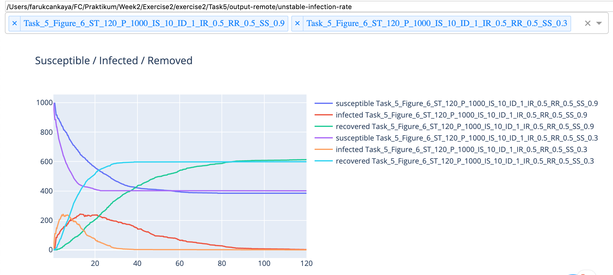
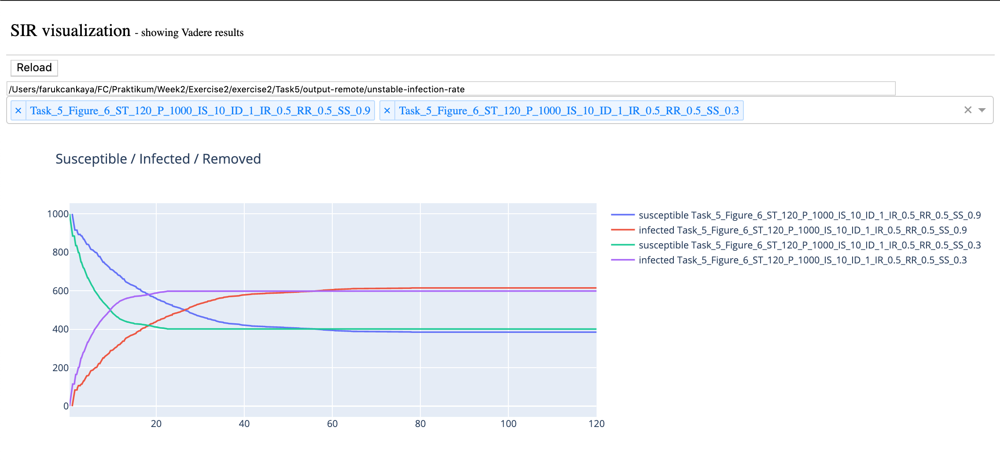

# SIRvisualization
SIRVisualization is a tool to show output data of Vadere simulation on a graph.

## Setup
- Python Version: 3.7
- Required packages are written in <a href="https://github.com/crowdmodeling20ss/sir-visualization/blob/master/requirements.txt">requirements.txt</a>

We strongly recommend you to use virtual environment to run this tool. Follow steps below to run this tool easily:
- First you need to install Python 3.7. Instructions here for macOS users. If you are windows user follow <a href="https://packaging.python.org/guides/installing-using-pip-and-virtual-environments/">here</a>.
- Install environment:
  `python3 -m pip install --user virtualenv`
- Run command below to create and activate environment inside the directory where you find this README.md:
  `python3 -m venv env`
  `source env/bin/activate`
- Install <a href="https://github.com/crowdmodeling20ss/sir-visualization/blob/master/requirements.txt">requirements.txt</a>
  `pip install -r requirements.txt`
  
- After setup python environment, you can run application via:
  `python3 app.py`

- For the next usage you just need to activate environment via `source env/bin/activate`, then start application with same command `python3 app.py`.
- Application should be started on port 8050. You can open it on your browser clicking here: <a href="http://localhost:8050">http://localhost:8050</a>
Example screen:

